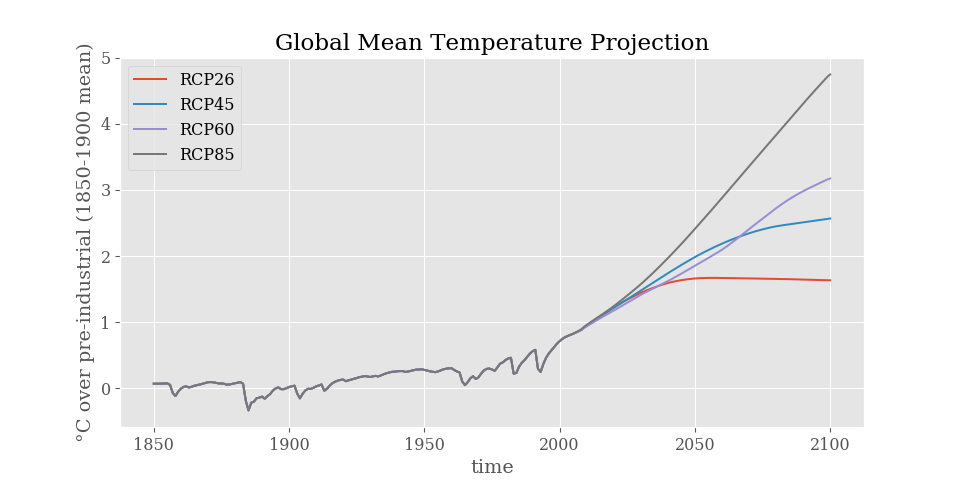

# pymagicc

[](https://travis-ci.org/openclimatedata/pymagicc)
[](https://ci.appveyor.com/project/openclimatedata/pymagicc)
[](https://codecov.io/gh/openclimatedata/pymagicc)
[](https://pypi.python.org/pypi/pymagicc)
[](https://pypi.python.org/pypi/pymagicc)
[](https://mybinder.org/v2/gh/openclimatedata/pymagicc/master?filepath=notebooks/index.ipynb)

Pymagicc is a thin Python wrapper around the reduced complexity climate model
[MAGICC6](http://magicc.org/). It wraps the CC-BY-NC-SA licensed
[MAGICC6 binary](http://www.magicc.org/download6).

See http://www.magicc.org/ for further information about the MAGICC model.

## Basic Usage

```python
import pymagicc
from pymagicc import scenarios

for name, scen in scenarios.items():
    results, params = pymagicc.run(scen, return_config=True)
    temp = results["SURFACE_TEMP"].GLOBAL.loc[1850:] - results["SURFACE_TEMP"].GLOBAL.loc[1850:1900].mean()
    temp.plot(label=name)
plt.legend()
plt.title("Global Mean Temperature Projection")
plt.ylabel(u"°C over pre-industrial (1850-1900 mean)")
```




## Installation

    pip install pymagicc

On Linux and OS X the original compiled Windows binary available on
http://www.magicc.org/ and included in Pymagicc
can run using [Wine](https://www.winehq.org/).

On 32-bit systems Debian/Ubuntu-based systems `wine` can be installed with

    sudo apt-get install wine

On 64-bit systems one needs to use the 32-bit version of Wine:

    sudo dpkg --add-architecture i386
    sudo apt-get install wine32

On OS X `wine` is available in the Homebrew package manager:

    brew install wine


## More Usage Examples

### Use an included scenario

```python
from pymagicc import rcp3pd

rcp3pd["WORLD"].head()
```

### Read a MAGICC scenario file

```python
from pymagicc import read_scen_file

scenario = read_scen_file("PATHWAY.SCEN")
```

### Create a new scenario

Pymagicc uses Pandas DataFrames to represent scenarios. Dictionaries are
used for scenarios with multiple regions.

```python
import pandas as pd

scenario = pd.DataFrame({
    "FossilCO2": [8, 10, 9],
    "OtherCO2": [1.2, 1.1, 1.2],
    "CH4": [300, 250, 200]},
    index=[2010, 2020, 2030]
)

```

### Run MAGICC for a scenario

```python
output = pymagicc.run(scenario)

# Projected temperature adjusted to pre-industrial mean
temp = output["SURFACE_TEMP"].GLOBAL - \
       output["SURFACE_TEMP"].loc[1850:2100].GLOBAL.mean()
```


## License

The [compiled MAGICC binary](http://www.magicc.org/download6) by Tom Wigley,
Sarah Raper, and Malte Meinshausen included in this package is licensed under a [Creative Commons Attribution-NonCommercial-ShareAlike 3.0 Unported License](https://creativecommons.org/licenses/by-nc-sa/3.0/).


The `pymagicc` wrapper is free software under the GNU Affero General Public
License v3, see [LICENSE](./LICENSE).

If you make any use of MAGICC, please cite:

> M. Meinshausen, S. C. B. Raper and T. M. L. Wigley (2011). "Emulating coupled
atmosphere-ocean and carbon cycle models with a simpler model, MAGICC6: Part I
"Model Description and Calibration." Atmospheric Chemistry and Physics 11: 1417-1456.
[doi:10.5194/acp-11-1417-2011](https://dx.doi.org/10.5194/acp-11-1417-2011)

See also the [MAGICC website](http://magicc.org/) and
[Wiki](http://wiki.magicc.org/index.php?title=Main_Page)
for further information.
